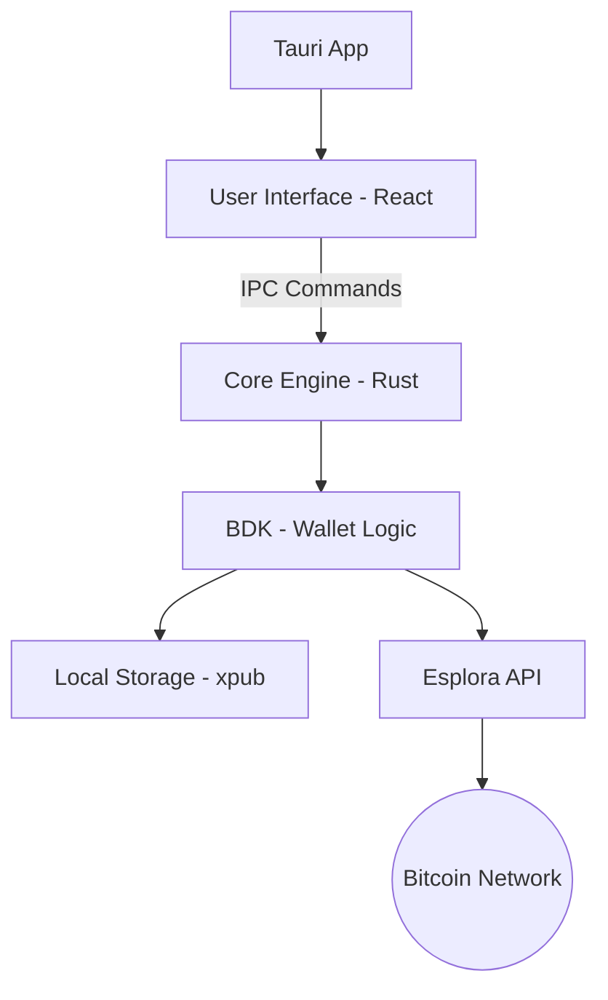

# Bitcoin Watch-Only Desktop Wallet - 3min

이 프로젝트는 비트코인 확장 공개키(xpub)를 사용하여 잔고를 확인하고, 트랜잭션을 생성 및 전송할 수 있는 데스크탑 어플리케이션입니다. 개인키를 직접 입력하지 않고 공개키만 사용하므로 보안성이 뛰어난 'Watch-Only' 방식을 채택합니다.

## 🚀 프로젝트 목표

비트코인 네트워크의 데이터를 안전하게 조회하고 보관하며, 사용자 친화적인 인터페이스를 통해 UTXO 기반의 자산 관리를 경험할 수 있는 데스크탑 앱을 구현합니다.

---

## 🛠 기술 스택 (기술 사양)

| 구분 | 기술 | 설명 |
| :--- | :--- | :--- |
| **Desktop Framework** | **Tauri 2.0** | Rust 기반의 경량화된 보안 데스크탑 프레임워크 |
| **Core Engine (Logic)** | **Rust** + **BDK** | 시스템 권한 및 비트코인 핵심 로직을 담당하는 엔진 |
| **User Interface (UI)** | **React** + **Vite** | 사용자 상호작용 및 데이터 시각화를 담당하는 프론트엔드 |
| **Bitcoin Library** | **BDK (Rust)** | BIP32, 44, 49, 84 등을 지원하는 네이티브 라이브러리 |
| **Blockchain Sync** | **Esplora** (Mempool API) | 블록체인 데이터와의 실시간 동기화 |
| **Local Storage** | **Tauri Plugin Store** | 보안이 강화된 로컬 데이터 저장소 |

---

## 🏗 시스템 아키텍처



---

## 🔒 보안 핵심 원칙

1. **Passive Security**: 사용자의 개인키(Private Key)를 절대로 프로그램 내에서 요구하거나 저장하지 않습니다.
2. **Memory Safety**: Rust의 소유권 모델과 타입 시스템을 통해 메모리 오염 및 관련 취약점을 원천 차단합니다.
3. **Rust-based Logic**: 핵심 지갑 로직(BDK)을 네이티브 환경(Rust)에서 실행하여 JS 환경보다 안전한 보안 샌드박스를 구축합니다.
4. **Local Data**: 모든 설정값은 Tauri Plugin Store를 통해 로컬 환경에만 안전하게 저장됩니다.

---

## 🏗 시작하기 (개발 환경 구축)

```bash
# 의존성 설치
npm install

# 개발 모드 실행
npm run tauri dev
```
